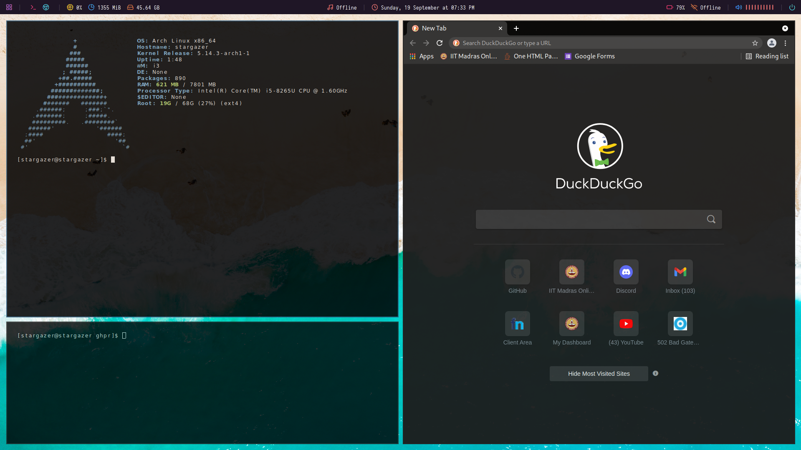

# Arch setup

Hi, this is my minimalistic arch setup, running i3-gaps window manager. I've spent hours trying to get the setup I like. And to be honest, I really like my setup a lot.
So I thought why not share my configuration with other users. If you want to achieve the same aesthetics then you may use my config files.

### Clone this repo to anywhere on your pc and follow the guide below.
    
    $ git clone https://github.com/iitmod/setup.git

## Here are a few things that you need to know:

1. The OS is **Arch Linux**
2. This setup runs on X11
3. This setup runs **i3-gaps** wm.
4. i3 bar has been replaced with polybar.

So, if your system doesnt match as of mine, you'll have to do a bit of work around.

Here's how my setup looks:
[

## Here's a little guide to the setup.

### i3 wm
1. Copy the config file in i3-setup folder to ~/.config/i3/config
2. I've added some keybindings of my own. You may want to change them according to your
   workflow (checkout the config file, I've commented the bindings)
3. I use polybar as a replacement of i3-bar. The bar already has a autostart command (with forest theme). 
   You can get the theme from [here](https://github.com/adi1090x/polybar-themes) (I use the forest theme).
   Follow the guide given in repo.
4. My default terminal is **URxvt**, you'll have to set your "sensible terminal". Follow the official i3 guide [here](https://i3wm.org/docs/userguide.html)
   to set your sensible terminal.
5. Picom is set to autostart.
6. My wallpaper can be found in *img/wallpaper.jpg*. This setup uses feh for setting wallpaper, it has been added to
   autostart in i3.
7. My setup uses rofi. To configure the theme of rofi type <code>$ rofi-theme-selector</code> in your terminal
8. This setup uses alsamixer, and clight for sound and backlight respectively. Controls have been bound to the function keys.

### X11 and URxvt
1. The setup has URxvt real transparency and *Deja Vu* font. To set the transparency (assuming you're on X11), you'll have to install picom 
   and **copy picom.conf from picom/picom.conf to ~/.config/picom.conf**
2. The transparency of the windows changes according to focus, windows that are not in focus will be more transparent.
   And this tranparency applies to most of the apps, in my setup the transparency looks best on apps in dark mode.  
3. [Terminal Sexy](terminal.sexy) is a nice website to visually configure your colorscheme, do check it out (it'll save much of your time).      
4. If you want to make the arch logo appear on your terminal, you may use archey or neofetch and add the it to your .bashrc file
   to make it run everytime you open your terminal.

### Some other little tips

1. I recommed using fzf in your daily life, it'll make your work a lot easier. Combine it with any app, it has enormous possibilities.
   I recommend using it with ripgrep is recommended.
2. You may use lightdm web kit as your login manager, it has many themes available.
3. For most of issues that you face in arch, [archwiki](wiki.archlinux.org) probably has the solution. Arch has the best documentation.
4. TIV is a nice terminal image viewer, combine it with fzf to preview your photos in your terminal on the go.

  
Do tell me if I can add anything.

Btw, I use arch.
